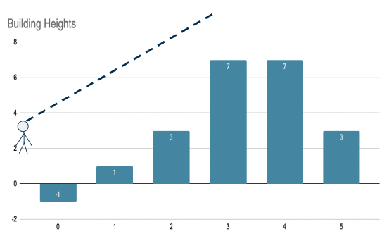

# algorithm-practice
Industry Prep: Algorithm Practice 

## Rotate List Problem
Given a list [1, 2, 3, 4, 5] and a number 3, rotate the items in the list 3 places over to the right. The output should be: [3, 4, 5, 1, 2].

Hard mode: Rotate the list "in-place" without creating a new list.

Write your clarifying questions and implementation in `rotate_list.py`. To execute your code, run `python3 rotate_list.py` in the terminal.

## Skyline Problem
Imagine a skyline of buildings and you were standing in front of them at ground level 0. How many of these buildings could you see?

Given a list [-1, 1, 3, 7, 7, 3] determine which values could be "seen."

The output should be: [1,3,7]

Write your clarifying questions and implementation in `skyline.py`. To execute your code, run `python3 skyline.py` in the terminal.

